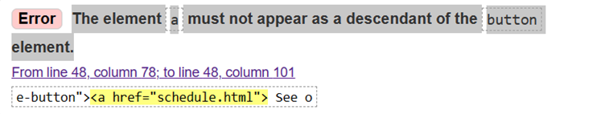
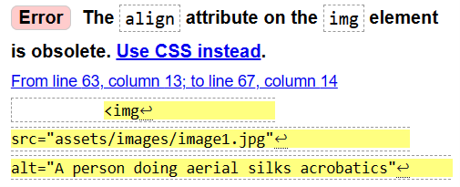

# SkyScape

SkyScape is a website for a fictional aerial arts studio. The business operates like a gym and has classes scheduled weekly for aerial hoop, silks and trapeze. The website has a dual purpose; to advertise classes to new customers, and to inform current customers of class times. It will also provide information on how to get in touch with the business owners.

Here is a link to the deployed site:

## UX: User Experience

### User stories

First time visitors to the site want to learn:

* The purpose of the site
* More about the business and where they are based
* How to easily navigate the website at first glance
* The cost of joining the aerial classes
* The schedule of classes and a brief explanation of the classes.

Returning or frequent visitors to the site want to:

* Find information about scheduled classes easily
* Find out how to get in touch with the business owners.

### Scope

*	A navigation bar for easy navigation of the site,

*	Simple home page that explains what type of aerial apparatus the studio covers,
*	Schedule of studio classes along with the price of classes,
*	Easy to access contact information and space for site visitors to send a message to the business owners,
*	Social media links located in the footer.

### Structure

#### Header bar, present on each page–

Logo and business name ‘SkyScape’ on left side

Navigation links to the right (home, class schedule, contact), that condenses down to hamburger menu for mobile devices

Footer, present on each page, stack on top of each other for mobile devices –
	Address
	Phone number
	Social media links (Facebook, Twitter, Instagram)

#### Home or landing page –

Header

Business name, tagline, and basic introduction to the business

Link to schedule

Photos and hover over function to explain the three types of apparatus available

Mobile devices have background image and no information about different apparatus types

#### Schedule –

Header

Columns for three types of classes, including a photo of each to illustrate. List of class times and prices. Mobile devices have background image and schedule stacked above one another.

#### Contact –

Header

Decorative photo for illustrative purposes

Contact form

Mobile version has background image and form overlay.

### Wireframes

Wireframes were created using [Figma](https://www.figma.com)

Home/Landing page:

Class schedule page:

Contact page:

### Surface

#### Design

The theme will be based on pastel sky, pink and light blue tones in background to illustrate the SkyScape theme and the elegant nature of aerial arts. Also in line with the fact that aerial arts are done in the air.

#### Colours

Colours for the site have taken inspiration from a pastel night sky, with light hues of purple and pinks.

A colour scheme has been chosen by using [Coolors.co](https://coolors.co/8783d1-aa9aba-bfa4a4-d1abad-e3b9bc)

#### Fonts

Fonts were decided by using [FontJoy](https://fontjoy.com/#)

Fonts chosen were: 

Headings and titles - Montserrat Alternates
General text - Abhaya Libre
Back-up font - sans-serif

#### Images

All images chosen will have a light colour tone and will follow a similar colour theme.

Mobile background image is purposefully elegant, with light coloured silk that evokes a feeling of relaxation and elegance.

## Resources & Technologies Used

### Languages used

* HTML
* CSS

### Frameworks used 

* [Bootstrap](https://getbootstrap.com/docs/4.4/getting-started/introduction/) - Bootstrap was used to help make the site more responsible, and to ensure we were creating a mobile-first UXD.

* [Google Fonts](https://fonts.google.com/) - Fonts were imported from Google, with [FontJoy](https://fontjoy.com/#) helping to ensure suitable font pairings.

* [Font Awesome](https://fontawesome.com/) - Icons for social links in the footer, which is good UX as users will recognise these icons. 

* [Figma](https://www.figma.com) - Used for creating Wireframes. 

* [Unsplash](https://unsplash.com/) - 2 of the images were downloaded free from Unsplash for the index.html page. 

* [Pixabay](https://pixabay.com/) - 1 image was downloaded free from Pixabay for the home page. 

* Git - Both GitHub and Git were used for storing the code, and for version control. 

* [HTML Formatter](https://www.freeformatter.com/html-formatter.html) - HTML Formatter was used to ensure HTML was formatted neatly, and to remove unecessary spaces.

## Testing 

Used HTML Validator to test the code, here are the errors that appered: 

* Using the element 'a' as a descendent of the button element. 

  Fixed by changing the elements to 'a' then using the class to format as a button with Bootstrap. 
  
* Align attribute on an img element, should use CSS instead. 

Fixed by removing the align element as was obsolete. 

* 